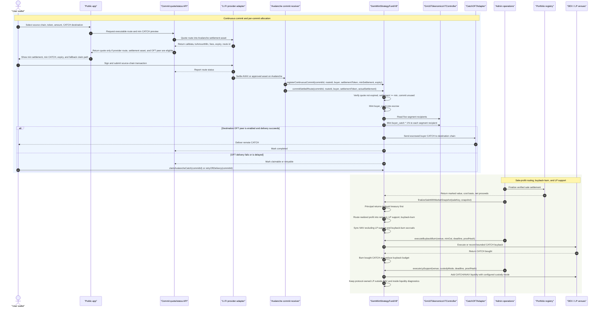

# CATCH Continuous Accrual Production Readiness Implementation Plan

> **For agentic workers:** REQUIRED SUB-SKILL: Use superpowers:subagent-driven-development (recommended) or superpowers:executing-plans to implement this plan task-by-task. Steps use checkbox (`- [ ]`) syntax for tracking.

**Goal:** Make the upgraded CATCH continuous-accrual architecture production-ready by fixing every threat, bug, regression, and breaking-change gate identified in `docs/security/catch-continuous-accrual-threat-model.md`.

**Architecture:** Ship the migration as a new V8 contract surface that preserves deployed storage, disables redemption, replaces fixed sale waterfalls with dynamic reinvest/LP/burn routing, excludes market-support assets from NAV, and adds settlement-based continuous minting with per-commit segment allocations. The public app and admin app then migrate to the V8 vocabulary: continuous commit, conservative NAV, liquidity support, and buyback-and-burn, with no APR/APY, routine holder claim, or redemption copy.

**Tech Stack:** Solidity 0.8.24, OpenZeppelin upgradeable contracts, Hardhat, LayerZero OFT adapter, LI.FI quote/status APIs, React 18, Vite, wagmi/viem, Node test runner, Vitest.

---

## Source Requirements

Authoritative specs and gates:

- `docs/architecture/catch-continuous-accrual-architecture.md`
- `docs/security/catch-continuous-accrual-threat-model.md`

Threats closed by this plan:

- T1 through T17 from the threat model.

Bugs and regressions closed by this plan:

- B1 fixed sale accounting.
- B2 NAV including market-support buckets.
- B3 segment allocations happening only at round finalization.
- B4 redemption still available in contract surfaces.
- B5 public frontend holder-claim and distribution promises.
- B6 tests asserting the old waterfall.
- B7 LI.FI tooling limited to purchase funding.
- B8 ambiguous LP custody mode.
- B9 Mobula overclaiming.

## UML Review Diagram

This diagram is the target production interaction model. Review it before implementation starts; any disagreement here should be resolved before Task 1.



## Implementation Adjustment: Bytecode Budget

The first implementation pass proved that `GemMintStrategyFundV8` has very little bytecode headroom because V7 is already close to the EIP-170 limit. Production implementation must keep the fund proxy lean:

- Keep conservative NAV, redemption shutdown, and minimal mint preview in `GemMintStrategyFundV8`.
- Put sale-profit route calculation in `Gm10SaleProfitRouter` instead of inlining it in V8.
- Put larger continuous commit, OFT delivery, buyback execution, LP execution, route eligibility, and admin status logic into focused coordinator/helper contracts or offchain/admin modules where possible.
- Re-check `GemMintStrategyFundV8` deployed bytecode after every contract task. The current target is strictly below `24,576` bytes.

## File Structure

### Contracts

- Create `contracts/contracts/GemMintStrategyFundV8.sol`
  - Owns V8 upgrade behavior, continuous mint, dynamic routing, NAV sync override, redemption kill switch, buyback budget, LP support budget, and pause controls.
- Create `contracts/contracts/Gm10SaleProfitRouter.sol`
  - Computes sale-profit routing bands outside V8 so the upgrade contract stays deployable under EIP-170.
- Create `contracts/contracts/interfaces/IGm10ContinuousMintReceiver.sol`
  - Interface used by the fund, admin, and tests for settlement-based minting.
- Create `contracts/contracts/interfaces/IGm10ContinuousSaleRouter.sol`
  - Interface for sale-profit route preview and finalization events.
- Create `contracts/contracts/mocks/MockCatchOFTDeliveryAdapter.sol`
  - Test-only adapter that can simulate successful and failed OFT delivery.
- Modify `contracts/contracts/Gm10Types.sol`
  - Add structs for continuous commit records, route snapshots, sale-profit routes, buyback execution, and LP execution.
- Modify `contracts/contracts/GemMintStrategyFundV7.sol`
  - Keep legacy round-finalization allocation behavior unchanged for V7 history; V8 overrides it and adds no new V7 behavior.
- Modify `contracts/scripts/upgradeToV7Tokenomics.js`
  - Leave behavior unchanged; do not reuse it for V8.
- Create `contracts/scripts/upgradeToV8ContinuousAccrual.js`
  - Deploy and prepare the V8 implementation, validate initializer, and print Safe transaction payload.
- Modify `contracts/deployments.json`
  - Add V8 implementation and optional deployment metadata only after deployment.

### Contract Tests

- Create `contracts/test/GemMintStrategyFundV8ContinuousMint.test.js`
- Create `contracts/test/GemMintStrategyFundV8SaleRouting.test.js`
- Create `contracts/test/GemMintStrategyFundV8BuybackLp.test.js`
- Create `contracts/test/GemMintStrategyFundV8UpgradeSafety.test.js`
- Modify `contracts/test/GemMintStrategyFundV7.test.js`
  - Keep V7 historical tests stable and add proof that V8 tests cover the new target behavior.

### Admin App And APIs

- Create `apps/admin/server/lib/continuous-commit.js`
  - Pure functions for route eligibility, quote hash, quote expiry, min settlement, and commit status normalization.
- Modify `apps/admin/server/lib/lifi.js`
  - Keep purchase-funding helpers; add generic commit quote helpers without breaking existing purchase funding.
- Create `apps/admin/api/continuous-commit-quote.js`
- Create `apps/admin/api/continuous-commit-status.js`
- Modify `api/lifi-quotes.js`, `api/lifi-status.js`
  - Keep exports for existing routes; add new top-level exports only if public app calls need same-origin APIs.
- Modify `apps/admin/src/abis.ts`
  - Add V8 ABI fragments for continuous mint, sale routing, buyback, LP support, and pause state.
- Modify `apps/admin/src/panels/OperationsPanel.tsx`
  - Add sale routing preview, buyback execution, LP execution, route status, and stale snapshot blocks.
- Create `apps/admin/tests/continuous-commit.test.mjs`
- Create `apps/admin/tests/sale-routing.test.mjs`
- Create `apps/admin/tests/buyback-lp.test.mjs`

### Public Frontend

- Modify `src/data/contracts.ts`
  - Add V8 ABI fragments used by public reads.
- Modify `src/data/protocol.ts`
  - Replace old fixed waterfall constants and copy with continuous accrual constants.
- Create `src/data/continuousAccrual.ts`
  - Pure presentation and math helpers for premium/discount, mint availability, route eligibility, and sale-profit route labels.
- Create `src/data/continuousAccrual.test.ts`
- Modify `src/hooks/useHolderDashboard.ts`
  - Remove APR/APY/claim labels from primary holder state; expose conservative NAV and market-support diagnostics.
- Create `src/hooks/useContinuousCommit.ts`
  - Quote, expiry, status, retry, and claim-state hook for public commit flow.
- Modify `src/pages/Fundraising.tsx`
  - Convert from finite Round 2 purchase UI to continuous commit UI or redirect to the new page.
- Modify `src/pages/FundraisingV2.tsx`
  - Same behavior as `Fundraising.tsx` if it remains routed.
- Modify `src/pages/Holders.tsx`
  - Remove holder-claim UI and show NAV, market depth, buyback/burn, and no-redemption state.
- Modify `src/pages/HoldersV2.tsx`
  - Remove holder-claim UI and show NAV, market depth, buyback/burn, and no-redemption state.
- Modify `src/pages/Catch.tsx`
  - Remove fixed holder-claim waterfall panel.
- Modify `src/components/ProtocolDiagrams.tsx`
  - Replace holder-claim diagram slices with dynamic reinvest/LP/burn routing.
- Modify `src/App.test.tsx`
  - Remove old 25/40/35 assertions and add user-facing regression coverage for no APY/APR/claim/redemption copy.

## Milestone 1: Contract Upgrade Foundation

Purpose: create the V8 upgrade surface, preserve storage safety, remove redemption, and make NAV conservative before adding new external flows.

Threats closed: T2, T4, T15, T16.

Bugs closed: B2, B4.

### Task 1: Add V8 Types And Interfaces

**Files:**

- Modify: `contracts/contracts/Gm10Types.sol`
- Create: `contracts/contracts/interfaces/IGm10ContinuousMintReceiver.sol`
- Create: `contracts/contracts/interfaces/IGm10ContinuousSaleRouter.sol`

- [ ] **Step 1: Write the failing compile expectation**

Add imports for the new interfaces in a temporary V8 test file:

```js
const { expect } = require("chai");

describe("GemMintStrategyFundV8 interfaces", function () {
  it("compiles the continuous accrual interfaces", async function () {
    const artifactNames = [
      "IGm10ContinuousMintReceiver",
      "IGm10ContinuousSaleRouter",
    ];

    for (const name of artifactNames) {
      const artifact = await hre.artifacts.readArtifact(name);
      expect(artifact.abi.length).to.be.greaterThan(0);
    }
  });
});
```

- [ ] **Step 2: Run compile to verify it fails**

Run:

```bash
npm --prefix contracts test -- --grep "GemMintStrategyFundV8 interfaces"
```

Expected: FAIL because the new interfaces do not exist.

- [ ] **Step 3: Add the interfaces and structs**

Add these struct names to `Gm10Types.sol`:

```solidity
struct ContinuousCommit {
    bytes32 commitId;
    bytes32 providerRouteId;
    uint256 sourceChainId;
    address sourceToken;
    address settlementToken;
    address buyer;
    uint256 minSettlementAmount;
    uint256 settledAmount;
    uint256 mintedBuyerCatch18;
    uint256 mintedSegmentCatch18;
    uint64 quoteExpiresAt;
    bool consumed;
    bool deliveryRequested;
    bool deliveryCompleted;
}

struct MarketSnapshot {
    int256 spotPremiumBps;
    uint256 lpCoverageBps;
    uint256 protocolLpCoverageBps;
    uint256 slippageDepthScoreBps;
    uint256 liquidTreasuryRatioBps;
    uint256 saleRoiBps;
    bytes32 proofHash;
    uint64 observedAt;
}

struct SaleProfitRoute {
    uint256 reinvestBps;
    uint256 lpSupportBps;
    uint256 buybackBurnBps;
}

struct BuybackBurnExecution {
    address venue;
    address tokenIn;
    uint256 amountIn;
    uint256 minCatchOut;
    uint256 deadline;
    bytes32 proofHash;
}

struct LpSupportExecution {
    address venue;
    uint256 catchAmount;
    uint256 pairedAvaxAmount;
    uint8 custodyMode;
    uint256 deadline;
    bytes32 proofHash;
}
```

Create `IGm10ContinuousMintReceiver.sol` with:

```solidity
// SPDX-License-Identifier: MIT
pragma solidity ^0.8.24;

interface IGm10ContinuousMintReceiver {
    function previewContinuousMint(uint256 settlementAmountUsdt6)
        external
        view
        returns (uint256 buyerCatch18, uint256 segmentCatchEach18, uint256 mintPriceUsdt6);

    function commitSettledRoute(bytes32 commitId, bytes32 providerRouteId, address buyer, address settlementToken, uint256 settledAmount)
        external
        returns (uint256 buyerCatch18);

    function retryOftDelivery(bytes32 commitId) external payable;

    function claimAvalancheCatch(bytes32 commitId) external;
}
```

Create `IGm10ContinuousSaleRouter.sol` with:

```solidity
// SPDX-License-Identifier: MIT
pragma solidity ^0.8.24;

import { Gm10Types } from "../Gm10Types.sol";

interface IGm10ContinuousSaleRouter {
    function previewSaleProfitRoute(uint256 realizedProfitUsdt6, Gm10Types.MarketSnapshot calldata snapshot)
        external
        view
        returns (Gm10Types.SaleProfitRoute memory route);

    function finalizeSaleWithMarketSnapshot(bytes32 saleKey, Gm10Types.MarketSnapshot calldata snapshot)
        external;
}
```

- [ ] **Step 4: Run compile to verify it passes**

Run:

```bash
npm --prefix contracts test -- --grep "GemMintStrategyFundV8 interfaces"
```

Expected: PASS.

### Task 2: Add V8 Contract Skeleton And Storage Gap

**Files:**

- Create: `contracts/contracts/GemMintStrategyFundV8.sol`
- Test: `contracts/test/GemMintStrategyFundV8UpgradeSafety.test.js`

- [ ] **Step 1: Write failing upgrade-safety tests**

Create tests that deploy through the current proxy fixture, upgrade to V8, call `initializeV8`, and assert:

```js
expect(await fund.redemptionsPermanentlyDisabled()).to.equal(true);
expect(await fund.continuousMintPaused()).to.equal(true);
expect(await fund.buybackPaused()).to.equal(true);
expect(await fund.lpSupportPaused()).to.equal(true);
```

- [ ] **Step 2: Run the failing tests**

Run:

```bash
npm --prefix contracts test -- --grep "GemMintStrategyFundV8 upgrade"
```

Expected: FAIL because `GemMintStrategyFundV8` does not exist.

- [ ] **Step 3: Implement the V8 skeleton**

Use:

```solidity
// SPDX-License-Identifier: MIT
pragma solidity ^0.8.24;

import "./GemMintStrategyFundV7.sol";
import "./Gm10Types.sol";

contract GemMintStrategyFundV8 is GemMintStrategyFundV7 {
    bool public redemptionsPermanentlyDisabled;
    bool public continuousMintPaused;
    bool public buybackPaused;
    bool public lpSupportPaused;
    bool public saleRoutingPaused;

    int256 public mintSpreadBps;
    uint256 public dailyMintCapBps;
    uint256 public perWalletMintCapBps;
    uint256 public buybackBurnAccruedUsdt6;
    uint256 public lpSupportAccruedUsdt6;

    mapping(bytes32 => Gm10Types.ContinuousCommit) internal continuousCommits;

    event ContinuousAccrualInitialized(int256 mintSpreadBps);

    /// @custom:oz-upgrades-validate-as-initializer
    function initializeV8() external reinitializer(8) {
        redemptionsPermanentlyDisabled = true;
        continuousMintPaused = true;
        buybackPaused = true;
        lpSupportPaused = true;
        saleRoutingPaused = true;
        mintSpreadBps = -500;
        dailyMintCapBps = 500;
        perWalletMintCapBps = 100;
        emit ContinuousAccrualInitialized(mintSpreadBps);
    }

    uint256[43] private __gapV8;
}
```

- [ ] **Step 4: Run the tests**

Run:

```bash
npm --prefix contracts test -- --grep "GemMintStrategyFundV8 upgrade"
```

Expected: PASS.

### Task 3: Disable Redemption Permanently In V8

**Files:**

- Modify: `contracts/contracts/GemMintStrategyFundV8.sol`
- Test: `contracts/test/GemMintStrategyFundV8UpgradeSafety.test.js`

- [ ] **Step 1: Write failing redemption tests**

Add assertions:

```js
await expect(fund.connect(investor).redeem(1n)).to.be.revertedWithCustomError(fund, "RedemptionsDisabled");
await expect(fund.connect(governance).setRedemptionsEnabled(true)).to.be.revertedWithCustomError(fund, "InvalidParameters");
```

- [ ] **Step 2: Run the failing tests**

Run:

```bash
npm --prefix contracts test -- --grep "V8 redemption"
```

Expected: FAIL because V8 does not override the setter.

- [ ] **Step 3: Override redemption controls**

Add to V8:

```solidity
function setRedemptionsEnabled(bool) public override onlyRole(GOVERNANCE_ROLE) {
    revert InvalidParameters();
}

function _redeem(address, uint256) internal pure override {
    revert RedemptionsDisabled();
}
```

If `setRedemptionsEnabled` is not currently `virtual`, first modify the inherited function declaration to make it `virtual`, then add a storage-layout regression test before upgrading a deployed proxy.

- [ ] **Step 4: Run the tests**

Run:

```bash
npm --prefix contracts test -- --grep "V8 redemption"
```

Expected: PASS.

### Task 4: Replace Stable NAV Formula

**Files:**

- Modify: `contracts/contracts/GemMintStrategyFundV8.sol`
- Test: `contracts/test/GemMintStrategyFundV8SaleRouting.test.js`

- [ ] **Step 1: Write failing NAV exclusion tests**

Build a scenario where sale profit accrues into LP and buyback buckets, then assert:

```js
const navBefore = await fund.navPerTokenUsdt6();
await fund.connect(manager).testAccrueMarketSupport(20_000_000n, 10_000_000n);
expect(await fund.navPerTokenUsdt6()).to.equal(navBefore);
```

Use a test helper only if it is inside a test-only mock contract.

- [ ] **Step 2: Run the failing tests**

Run:

```bash
npm --prefix contracts test -- --grep "V8 NAV excludes market support"
```

Expected: FAIL because current `_syncStableNav()` includes legacy support buckets.

- [ ] **Step 3: Override `_syncStableNav()`**

Use the target formula:

```solidity
function _syncStableNav() internal override {
    uint256 totalStableAssetsUsdt6 =
        liquidTreasuryUsdt6 +
        outstandingPurchaseReleasesUsdt6 +
        canonicalPortfolioValueUsdt6;

    uint256 supply = totalSupply();
    navPerTokenUsdt6 = supply == 0 ? 0 : Math.mulDiv(totalStableAssetsUsdt6, 1e18, supply);
}
```

Do not include `liquidityCatchBuyAccruedUsdt6`, `liquidityAvaxPairingAccruedUsdt6`, `buybackBurnAccruedUsdt6`, `lpSupportAccruedUsdt6`, or `holderDistributionAccruedUsdt6`.

- [ ] **Step 4: Run the tests**

Run:

```bash
npm --prefix contracts test -- --grep "V8 NAV excludes market support"
```

Expected: PASS.

### Milestone 1 Regression And Unit Tests

Run:

```bash
npm --prefix contracts test -- --grep "GemMintStrategyFundV8"
npm --prefix contracts test -- --grep "GemMintStrategyFundV7"
```

Milestone is complete only when:

- V8 initializes with continuous mint, buyback, LP, and sale routing paused.
- Redemption cannot be enabled through V8.
- NAV excludes market-support buckets.
- Existing V7 historical tests still pass.

## Milestone 2: Dynamic Sale-Profit Routing

Purpose: remove fixed 25/40/35 sale accounting and route realized profit into reinvestment, LP support, and buyback-burn using bounded market-state logic.

Threats closed: T2, T9, T10, T11, T15, T16.

Bugs closed: B1, B2, B8.

### Task 5: Implement Pure Route Preview

**Files:**

- Modify: `contracts/contracts/GemMintStrategyFundV8.sol`
- Test: `contracts/test/GemMintStrategyFundV8SaleRouting.test.js`

- [ ] **Step 1: Write table-driven route tests**

Test these cases:

```js
[
  { name: "premium", spotPremiumBps: 400, expected: [8500n, 1500n, 0n] },
  { name: "neutral", spotPremiumBps: 0, expected: [7500n, 2500n, 0n] },
  { name: "small discount", spotPremiumBps: -700, expected: [6500n, 2500n, 1000n] },
  { name: "large discount", spotPremiumBps: -2000, expected: [5500n, 2500n, 2000n] },
  { name: "deep discount", spotPremiumBps: -3500, expected: [4500n, 2500n, 3000n] },
]
```

Also test:

```js
expect(route.reinvestBps + route.lpSupportBps + route.buybackBurnBps).to.equal(10000n);
expect(route.reinvestBps).to.be.within(4000n, 9000n);
expect(route.lpSupportBps).to.be.within(1000n, 4000n);
expect(route.buybackBurnBps).to.be.within(0n, 3000n);
```

- [ ] **Step 2: Run the failing tests**

Run:

```bash
npm --prefix contracts test -- --grep "previewSaleProfitRoute"
```

Expected: FAIL because preview does not exist.

- [ ] **Step 3: Implement `previewSaleProfitRoute`**

Implement exactly the architecture bands:

```solidity
function previewSaleProfitRoute(uint256, Gm10Types.MarketSnapshot calldata snapshot)
    public
    view
    returns (Gm10Types.SaleProfitRoute memory route)
{
    if (block.timestamp - snapshot.observedAt > 30 minutes) revert StalePriceFeed();
    if (snapshot.proofHash == bytes32(0)) revert InvalidParameters();

    if (snapshot.spotPremiumBps >= 300) {
        route = Gm10Types.SaleProfitRoute(8500, 1500, 0);
    } else if (snapshot.spotPremiumBps > -500) {
        route = Gm10Types.SaleProfitRoute(7500, 2500, 0);
    } else if (snapshot.spotPremiumBps > -1500) {
        route = Gm10Types.SaleProfitRoute(6500, 2500, 1000);
    } else if (snapshot.spotPremiumBps > -3000) {
        route = Gm10Types.SaleProfitRoute(5500, 2500, 2000);
    } else {
        route = Gm10Types.SaleProfitRoute(4500, 2500, 3000);
    }

    if (snapshot.slippageDepthScoreBps < 5000 || snapshot.lpCoverageBps < 1000) {
        uint256 shift = route.reinvestBps >= 1000 ? 1000 : route.reinvestBps;
        route.reinvestBps -= shift;
        route.lpSupportBps += shift;
    }

    if (snapshot.liquidTreasuryRatioBps < 1000) {
        uint256 burnShift = route.buybackBurnBps >= 1000 ? 1000 : route.buybackBurnBps;
        route.buybackBurnBps -= burnShift;
        route.reinvestBps += burnShift;
        if (burnShift < 1000) {
            uint256 lpShift = route.lpSupportBps >= 1000 - burnShift ? 1000 - burnShift : route.lpSupportBps;
            route.lpSupportBps -= lpShift;
            route.reinvestBps += lpShift;
        }
    }

    if (route.reinvestBps < 4000 || route.reinvestBps > 9000) revert InvalidParameters();
    if (route.lpSupportBps < 1000 || route.lpSupportBps > 4000) revert InvalidParameters();
    if (route.buybackBurnBps > 3000) revert InvalidParameters();
}
```

- [ ] **Step 4: Run the tests**

Run:

```bash
npm --prefix contracts test -- --grep "previewSaleProfitRoute"
```

Expected: PASS.

### Task 6: Replace `finalizeSale` Accounting

**Files:**

- Modify: `contracts/contracts/GemMintStrategyFundV8.sol`
- Test: `contracts/test/GemMintStrategyFundV8SaleRouting.test.js`

- [ ] **Step 1: Write failing finalization tests**

Test profitable sale with a neutral snapshot:

```js
await fund.connect(manager).finalizeSaleWithMarketSnapshot(saleKey, neutralSnapshot);
const accounting = await fund.stableAccounting();
expect(accounting.holderDistributionAccrued).to.equal(0n);
expect(await fund.buybackBurnAccruedUsdt6()).to.equal(0n);
expect(await fund.lpSupportAccruedUsdt6()).to.equal(expectedProfit * 2500n / 10000n);
expect(accounting.liquidTreasury).to.equal(costBasis + expectedProfit * 7500n / 10000n);
```

Test discount snapshot:

```js
expect(await fund.buybackBurnAccruedUsdt6()).to.equal(expectedProfit * 1000n / 10000n);
```

- [ ] **Step 2: Run the failing tests**

Run:

```bash
npm --prefix contracts test -- --grep "finalizeSaleWithMarketSnapshot"
```

Expected: FAIL because the function does not exist.

- [ ] **Step 3: Implement finalization**

Add:

```solidity
function finalizeSaleWithMarketSnapshot(bytes32 saleKey, Gm10Types.MarketSnapshot calldata snapshot)
    external
    onlyRole(MANAGER_ROLE)
{
    if (saleRoutingPaused) revert EnforcedPause();
    (, uint256 markedValueUsdt6, uint256 costBasisUsdt6, uint256 netProceedsUsdt6) =
        IGm10PortfolioRegistry(portfolioRegistry).finalizeSale(saleKey);

    if (canonicalPortfolioValueUsdt6 >= markedValueUsdt6) {
        canonicalPortfolioValueUsdt6 -= markedValueUsdt6;
    } else {
        canonicalPortfolioValueUsdt6 = 0;
    }

    if (netProceedsUsdt6 <= costBasisUsdt6) {
        liquidTreasuryUsdt6 += netProceedsUsdt6;
        _syncStableNav();
        return;
    }

    uint256 realizedProfitUsdt6 = netProceedsUsdt6 - costBasisUsdt6;
    Gm10Types.SaleProfitRoute memory route = previewSaleProfitRoute(realizedProfitUsdt6, snapshot);
    liquidTreasuryUsdt6 += costBasisUsdt6 + Math.mulDiv(realizedProfitUsdt6, route.reinvestBps, 10_000);
    lpSupportAccruedUsdt6 += Math.mulDiv(realizedProfitUsdt6, route.lpSupportBps, 10_000);
    buybackBurnAccruedUsdt6 += realizedProfitUsdt6 - Math.mulDiv(realizedProfitUsdt6, route.reinvestBps + route.lpSupportBps, 10_000);

    emit SaleProfitRouted(saleKey, realizedProfitUsdt6, route.reinvestBps, route.lpSupportBps, route.buybackBurnBps, snapshot.proofHash);
    _syncStableNav();
}
```

Add an event with these indexed fields:

```solidity
event SaleProfitRouted(bytes32 indexed saleKey, uint256 realizedProfitUsdt6, uint256 reinvestBps, uint256 lpSupportBps, uint256 buybackBurnBps, bytes32 proofHash);
```

- [ ] **Step 4: Run finalization tests**

Run:

```bash
npm --prefix contracts test -- --grep "finalizeSaleWithMarketSnapshot"
```

Expected: PASS.

### Task 7: Define LP Custody Modes

**Files:**

- Modify: `contracts/contracts/GemMintStrategyFundV8.sol`
- Test: `contracts/test/GemMintStrategyFundV8BuybackLp.test.js`

- [ ] **Step 1: Write failing LP custody tests**

Assert:

```js
await expect(fund.executeLpSupport(lfjExecutionWithMode0)).to.emit(fund, "LpSupportExecuted");
await expect(fund.executeLpSupport(pharaohExecutionWithMode1)).to.emit(fund, "LpSupportExecuted");
await expect(fund.executeLpSupport(unsupportedModeExecution)).to.be.revertedWithCustomError(fund, "InvalidParameters");
```

- [ ] **Step 2: Implement custody constants**

Add:

```solidity
uint8 public constant LP_CUSTODY_BURNED = 0;
uint8 public constant LP_CUSTODY_PERMANENT_OWNER = 1;
```

Add venue config:

```solidity
mapping(address => uint8) public lpVenueCustodyMode;
```

Add governance setter:

```solidity
function setLpVenueCustodyMode(address venue, uint8 mode) external onlyRole(GOVERNANCE_ROLE) {
    if (venue == address(0)) revert InvalidParameters();
    if (mode > LP_CUSTODY_PERMANENT_OWNER) revert InvalidParameters();
    lpVenueCustodyMode[venue] = mode;
    emit LpVenueCustodyModeUpdated(venue, mode);
}
```

- [ ] **Step 3: Run LP custody tests**

Run:

```bash
npm --prefix contracts test -- --grep "LP custody"
```

Expected: PASS.

### Milestone 2 Regression And Unit Tests

Run:

```bash
npm --prefix contracts test -- --grep "V8.*Sale"
npm --prefix contracts test -- --grep "V8.*LP custody"
npm --prefix contracts test -- --grep "V8 NAV"
```

Milestone is complete only when:

- Fixed 25/40/35 accounting is not reachable in V8 sale finalization.
- Holder distribution stays zero for new V8 sales.
- Dynamic route bands match architecture values.
- LP support and buyback-burn accruals do not inflate NAV.
- LP execution has explicit venue custody rules.

## Milestone 3: Settlement-Based Continuous Mint And OFT Delivery

Purpose: add the infinite round mechanic safely: no mint from quote alone, per-commit allocations, quote/settlement idempotency, and user-safe OFT failure handling.

Threats closed: T1, T3, T4, T5, T6, T7, T8, T13, T14, T16.

Bugs closed: B3, B7.

### Task 8: Add Continuous Mint Preview

**Files:**

- Modify: `contracts/contracts/GemMintStrategyFundV8.sol`
- Test: `contracts/test/GemMintStrategyFundV8ContinuousMint.test.js`

- [ ] **Step 1: Write failing preview tests**

Assert:

```js
const [buyerCatch, segmentCatch, mintPrice] = await fund.previewContinuousMint(101_000_000n);
expect(mintPrice).to.equal(1_010_000n);
expect(buyerCatch).to.equal(100_000_000000000000000n);
expect(segmentCatch).to.equal(1_000_000000000000000n);
```

Use a fixture where `navPerTokenUsdt6()` is `1_000_000` and `mintSpreadBps` is `-500`.

- [ ] **Step 2: Implement preview math**

Add:

```solidity
function previewContinuousMint(uint256 settlementAmountUsdt6)
    public
    view
    returns (uint256 buyerCatch18, uint256 segmentCatchEach18, uint256 mintPriceUsdt6)
{
    if (settlementAmountUsdt6 == 0) revert InvalidParameters();
    if (navPerTokenUsdt6 == 0) revert InvalidParameters();
    int256 mintMultiplierBps = 10_000 + mintSpreadBps;
    if (mintMultiplierBps <= 0) revert InvalidParameters();
    mintPriceUsdt6 = Math.mulDiv(navPerTokenUsdt6, uint256(mintMultiplierBps), 10_000);
    buyerCatch18 = Math.mulDiv(settlementAmountUsdt6, 1e18, mintPriceUsdt6);
    segmentCatchEach18 = Math.mulDiv(buyerCatch18, 100, 10_000);
}
```

- [ ] **Step 3: Run preview tests**

Run:

```bash
npm --prefix contracts test -- --grep "previewContinuousMint"
```

Expected: PASS.

### Task 9: Commit Only From Verified Settlement

**Files:**

- Modify: `contracts/contracts/GemMintStrategyFundV8.sol`
- Test: `contracts/test/GemMintStrategyFundV8ContinuousMint.test.js`

- [ ] **Step 1: Write failing settlement tests**

Assert:

```js
await expect(fund.commitSettledRoute(commitId, routeId, buyer.address, usdc, 0n))
  .to.be.revertedWithCustomError(fund, "InvalidParameters");

await expect(fund.commitSettledRoute(commitId, routeId, buyer.address, usdc, minSettlement - 1n))
  .to.be.revertedWithCustomError(fund, "InvalidParameters");

await fund.commitSettledRoute(commitId, routeId, buyer.address, usdc, minSettlement);

await expect(fund.commitSettledRoute(commitId, routeId, buyer.address, usdc, minSettlement))
  .to.be.revertedWithCustomError(fund, "InvalidParameters");
```

- [ ] **Step 2: Implement commit state**

Add a commit registration function used by admin or receiver:

```solidity
function registerContinuousCommit(
    bytes32 commitId,
    bytes32 providerRouteId,
    address buyer,
    address settlementToken,
    uint256 minSettlementAmount,
    uint64 quoteExpiresAt
) external onlyRole(OPERATOR_ROLE) {
    if (continuousCommits[commitId].commitId != bytes32(0)) revert InvalidParameters();
    if (buyer == address(0) || settlementToken == address(0) || minSettlementAmount == 0) revert InvalidParameters();
    if (quoteExpiresAt <= block.timestamp) revert InvalidParameters();
    continuousCommits[commitId].commitId = commitId;
    continuousCommits[commitId].providerRouteId = providerRouteId;
    continuousCommits[commitId].buyer = buyer;
    continuousCommits[commitId].settlementToken = settlementToken;
    continuousCommits[commitId].minSettlementAmount = minSettlementAmount;
    continuousCommits[commitId].quoteExpiresAt = quoteExpiresAt;
}
```

Implement `commitSettledRoute` so it rejects quote-only state and only consumes registered settlement:

```solidity
function commitSettledRoute(bytes32 commitId, bytes32 providerRouteId, address buyer, address settlementToken, uint256 settledAmount)
    external
    onlyRole(OPERATOR_ROLE)
    returns (uint256 buyerCatch18)
{
    if (continuousMintPaused) revert EnforcedPause();
    Gm10Types.ContinuousCommit storage commit = continuousCommits[commitId];
    if (commit.commitId == bytes32(0) || commit.consumed) revert InvalidParameters();
    if (commit.providerRouteId != providerRouteId || commit.buyer != buyer || commit.settlementToken != settlementToken) revert InvalidParameters();
    if (block.timestamp > commit.quoteExpiresAt) revert InvalidParameters();
    if (settledAmount < commit.minSettlementAmount) revert InvalidParameters();

    (buyerCatch18, uint256 segmentCatchEach18,) = previewContinuousMint(settledAmount);
    commit.consumed = true;
    commit.settledAmount = settledAmount;
    commit.mintedBuyerCatch18 = buyerCatch18;
    commit.mintedSegmentCatch18 = segmentCatchEach18;
    _mint(address(this), buyerCatch18);
    _mintSegmentAllocations(segmentCatchEach18);
    liquidTreasuryUsdt6 += Math.mulDiv(settledAmount, 9000, 10_000);
    lpSupportAccruedUsdt6 += settledAmount - Math.mulDiv(settledAmount, 9000, 10_000);
    _syncStableNav();
}
```

- [ ] **Step 3: Run settlement tests**

Run:

```bash
npm --prefix contracts test -- --grep "commitSettledRoute"
```

Expected: PASS.

### Task 10: Mint Segment Allocations Per Commit

**Files:**

- Modify: `contracts/contracts/GemMintStrategyFundV8.sol`
- Test: `contracts/test/GemMintStrategyFundV8ContinuousMint.test.js`

- [ ] **Step 1: Write failing segment allocation tests**

Assert:

```js
await fund.commitSettledRoute(commitId, routeId, buyer.address, usdc, settlementAmount);
for (let segment = 0; segment < 5; segment += 1) {
  const recipient = await controller.segmentRecipient(segment);
  expect(await fund.balanceOf(recipient)).to.equal(expectedBuyerCatch / 100n);
}
expect(await fund.balanceOf(buyer.address)).to.equal(0n);
expect(await fund.balanceOf(await fund.getAddress())).to.equal(expectedBuyerCatch);
```

Buyer CATCH remains escrowed until local claim or OFT delivery succeeds.

- [ ] **Step 2: Add helper**

Add:

```solidity
function _mintSegmentAllocations(uint256 segmentCatchEach18) internal {
    if (segmentCatchEach18 == 0) return;
    for (uint8 segment = 0; segment < 5; ++segment) {
        _mint(IGm10TokenomicsV7Controller(tokenomicsController).segmentRecipient(segment), segmentCatchEach18);
    }
}
```

If `tokenomicsController` is private in V7, change it to `internal immutable` in V7 and rerun V7 tests.

- [ ] **Step 3: Keep V7 round behavior separate**

Do not remove V7 `_finalizeRound()` segment minting. Add V8 tests proving continuous commit does not require `_finalizeRound()`.

- [ ] **Step 4: Run segment tests**

Run:

```bash
npm --prefix contracts test -- --grep "segment allocations per commit"
```

Expected: PASS.

### Task 11: Add OFT Delivery Retry And Claim

**Files:**

- Modify: `contracts/contracts/GemMintStrategyFundV8.sol`
- Create: `contracts/contracts/mocks/MockCatchOFTDeliveryAdapter.sol`
- Test: `contracts/test/GemMintStrategyFundV8ContinuousMint.test.js`

- [ ] **Step 1: Write failing delivery tests**

Assert:

```js
await expect(fund.requestOftDelivery(commitId, dstEid, buyerBytes32, { value: fee }))
  .to.emit(fund, "OftDeliveryRequested");

await mockAdapter.setFailDelivery(true);
await expect(fund.requestOftDelivery(commitId2, dstEid, buyerBytes32, { value: fee }))
  .to.emit(fund, "OftDeliveryFailed");

await expect(fund.connect(buyer).claimAvalancheCatch(commitId2))
  .to.changeTokenBalances(fund, [fundAddress, buyer.address], [-expectedBuyerCatch, expectedBuyerCatch]);
```

- [ ] **Step 2: Implement delivery state**

Add:

```solidity
event OftDeliveryRequested(bytes32 indexed commitId, uint32 dstEid, bytes32 recipient);
event OftDeliveryCompleted(bytes32 indexed commitId);
event OftDeliveryFailed(bytes32 indexed commitId);
event AvalancheCatchClaimed(bytes32 indexed commitId, address indexed buyer, uint256 amount);
```

Implement `claimAvalancheCatch`:

```solidity
function claimAvalancheCatch(bytes32 commitId) external {
    Gm10Types.ContinuousCommit storage commit = continuousCommits[commitId];
    if (!commit.consumed || commit.deliveryCompleted) revert InvalidParameters();
    if (commit.buyer != msg.sender) revert InvalidParameters();
    uint256 amount = commit.mintedBuyerCatch18;
    if (amount == 0) revert InvalidParameters();
    commit.mintedBuyerCatch18 = 0;
    _transfer(address(this), msg.sender, amount);
    emit AvalancheCatchClaimed(commitId, msg.sender, amount);
}
```

Implement OFT delivery through the existing `CatchOFTAdapter` only after peer configuration checks exist in the deployment config. In tests, use the mock adapter to simulate success and failure.

- [ ] **Step 3: Run delivery tests**

Run:

```bash
npm --prefix contracts test -- --grep "OFT delivery"
```

Expected: PASS.

### Milestone 3 Regression And Unit Tests

Run:

```bash
npm --prefix contracts test -- --grep "V8.*Continuous"
npm --prefix contracts test -- --grep "OFT"
npm --prefix contracts test -- --grep "GemMintStrategyFundV8"
```

Milestone is complete only when:

- Minting cannot happen from a quote alone.
- Expired quotes cannot mint.
- Duplicate route IDs or commit IDs cannot mint twice.
- Below-min settlement cannot mint.
- Segment recipients receive 1 percent each per successful commit.
- Buyer CATCH is escrowed before delivery or claim.
- OFT failure leaves claimable Avalanche CATCH.

## Milestone 4: Buyback-Burn And LP Execution

Purpose: turn accrued market-support budgets into bounded execution paths with proof, slippage, deadline, burn, custody, and pause controls.

Threats closed: T2, T9, T10, T11, T16.

Bugs closed: B8.

### Task 12: Implement Buyback-Burn Execution

**Files:**

- Modify: `contracts/contracts/GemMintStrategyFundV8.sol`
- Test: `contracts/test/GemMintStrategyFundV8BuybackLp.test.js`

- [ ] **Step 1: Write failing buyback tests**

Assert:

```js
await expect(fund.executeBuybackBurn(validExecution))
  .to.emit(fund, "BuybackBurnExecuted");

await expect(fund.executeBuybackBurn(overBudgetExecution))
  .to.be.revertedWithCustomError(fund, "InsufficientFreeBalance");

await expect(fund.executeBuybackBurn(expiredExecution))
  .to.be.revertedWithCustomError(fund, "InvalidParameters");

await expect(fund.executeBuybackBurn(noProofExecution))
  .to.be.revertedWithCustomError(fund, "InvalidParameters");
```

- [ ] **Step 2: Add execution function**

Implement a proof-recording execution first; wire live DEX swap integration only after venue adapters are audited:

```solidity
function executeBuybackBurn(Gm10Types.BuybackBurnExecution calldata execution)
    external
    onlyRole(OPERATOR_ROLE)
{
    if (buybackPaused) revert EnforcedPause();
    if (execution.deadline < block.timestamp || execution.proofHash == bytes32(0)) revert InvalidParameters();
    if (execution.amountIn == 0 || execution.amountIn > buybackBurnAccruedUsdt6) revert InsufficientFreeBalance();
    buybackBurnAccruedUsdt6 -= execution.amountIn;
    emit BuybackBurnExecuted(execution.venue, execution.amountIn, execution.minCatchOut, execution.proofHash);
    _syncStableNav();
}
```

Add:

```solidity
event BuybackBurnExecuted(address indexed venue, uint256 amountInUsdt6, uint256 minCatchOut18, bytes32 proofHash);
```

- [ ] **Step 3: Run buyback tests**

Run:

```bash
npm --prefix contracts test -- --grep "BuybackBurn"
```

Expected: PASS.

### Task 13: Implement LP Support Execution

**Files:**

- Modify: `contracts/contracts/GemMintStrategyFundV8.sol`
- Test: `contracts/test/GemMintStrategyFundV8BuybackLp.test.js`

- [ ] **Step 1: Write failing LP execution tests**

Assert:

```js
await expect(fund.executeLpSupport(validLfjExecution))
  .to.emit(fund, "LpSupportExecuted");

await expect(fund.executeLpSupport(overBudgetLpExecution))
  .to.be.revertedWithCustomError(fund, "InsufficientFreeBalance");

await expect(fund.executeLpSupport(wrongCustodyModeExecution))
  .to.be.revertedWithCustomError(fund, "InvalidParameters");
```

- [ ] **Step 2: Add LP execution**

Implement:

```solidity
function executeLpSupport(Gm10Types.LpSupportExecution calldata execution)
    external
    onlyRole(OPERATOR_ROLE)
{
    if (lpSupportPaused) revert EnforcedPause();
    if (execution.deadline < block.timestamp || execution.proofHash == bytes32(0)) revert InvalidParameters();
    if (lpVenueCustodyMode[execution.venue] != execution.custodyMode) revert InvalidParameters();
    uint256 total = execution.catchAmount + execution.pairedAvaxAmount;
    if (total == 0 || total > lpSupportAccruedUsdt6) revert InsufficientFreeBalance();
    lpSupportAccruedUsdt6 -= total;
    emit LpSupportExecuted(execution.venue, execution.catchAmount, execution.pairedAvaxAmount, execution.custodyMode, execution.proofHash);
    _syncStableNav();
}
```

Add:

```solidity
event LpSupportExecuted(address indexed venue, uint256 catchAmountUsdt6, uint256 pairedAvaxAmountUsdt6, uint8 custodyMode, bytes32 proofHash);
```

- [ ] **Step 3: Run LP tests**

Run:

```bash
npm --prefix contracts test -- --grep "LpSupport"
```

Expected: PASS.

### Milestone 4 Regression And Unit Tests

Run:

```bash
npm --prefix contracts test -- --grep "V8.*Buyback"
npm --prefix contracts test -- --grep "V8.*Lp"
npm --prefix contracts test -- --grep "V8 NAV"
```

Milestone is complete only when:

- Buyback rejects stale or proofless execution.
- Buyback cannot exceed accrued budget.
- LP execution cannot exceed accrued budget.
- LP custody mode is venue-specific.
- Neither buyback nor LP execution inflates NAV.

## Milestone 5: Admin Quote, Routing, And Operations Migration

Purpose: make admin operations match the upgraded contracts and make cross-chain commit routing eligible, bounded, and observable.

Threats closed: T5, T6, T12, T13, T14, T17.

Bugs closed: B7, B9.

### Task 14: Add Continuous Commit Pure Helpers

**Files:**

- Create: `apps/admin/server/lib/continuous-commit.js`
- Create: `apps/admin/tests/continuous-commit.test.mjs`

- [ ] **Step 1: Write helper tests**

Test:

```js
assert.equal(isCommitRouteEligible({ providerSupported: true, oftPeerEnabled: true, settlementAssetApproved: true }), true);
assert.equal(isCommitRouteEligible({ providerSupported: true, oftPeerEnabled: false, settlementAssetApproved: true }), false);
assert.equal(isQuoteExpired({ nowSeconds: 1000, expiresAtSeconds: 999 }), true);
assert.equal(minSettlementSatisfied({ toAmountMinRaw: '1000', minSettlementRaw: '1000' }), true);
```

- [ ] **Step 2: Implement helpers**

Export:

```js
export function isCommitRouteEligible({ providerSupported, oftPeerEnabled, settlementAssetApproved }) {
  return Boolean(providerSupported && oftPeerEnabled && settlementAssetApproved);
}

export function isQuoteExpired({ nowSeconds, expiresAtSeconds }) {
  return Number(nowSeconds) >= Number(expiresAtSeconds);
}

export function minSettlementSatisfied({ toAmountMinRaw, minSettlementRaw }) {
  return BigInt(toAmountMinRaw) >= BigInt(minSettlementRaw);
}

export function quoteHash(input) {
  return JSON.stringify({
    provider: input.provider,
    fromChainId: Number(input.fromChainId),
    toChainId: Number(input.toChainId),
    fromToken: String(input.fromToken).toLowerCase(),
    settlementToken: String(input.settlementToken).toLowerCase(),
    receiver: String(input.receiver).toLowerCase(),
    toAmountMinRaw: String(input.toAmountMinRaw),
    expiresAtSeconds: Number(input.expiresAtSeconds),
  });
}
```

- [ ] **Step 3: Run helper tests**

Run:

```bash
npm --workspace gm10-admin test -- continuous-commit.test.mjs
```

Expected: PASS.

### Task 15: Add Commit Quote And Status APIs

**Files:**

- Modify: `apps/admin/server/lib/lifi.js`
- Create: `apps/admin/api/continuous-commit-quote.js`
- Create: `apps/admin/api/continuous-commit-status.js`
- Modify: `apps/admin/vite.config.ts`
- Test: `apps/admin/tests/continuous-commit.test.mjs`

- [ ] **Step 1: Write API tests**

Add tests that mock `fetch` and assert:

```js
assert.equal(response.statusCode, 200);
assert.equal(body.eligible, true);
assert.equal(body.quote.provider, 'lifi');
assert.equal(body.quote.expiresAtSeconds > nowSeconds, true);
```

Add rejected cases for missing OFT peer and expired quote.

- [ ] **Step 2: Implement quote API**

The API must accept:

```js
{
  "fromChainId": 137,
  "fromToken": "0x2791Bca1f2de4661ED88A30C99A7a9449Aa84174",
  "fromAddress": "0x1111111111111111111111111111111111111111",
  "sourceAmountRaw": "1000000",
  "settlementToken": "0xB97EF9Ef8734C71904D8002F8b6Bc66Dd9c48a6E",
  "receiver": "0x2222222222222222222222222222222222222222",
  "destinationChainId": 137
}
```

Return:

```js
{
  "eligible": true,
  "quote": {
    "provider": "lifi",
    "quoteHash": "canonical-json-string",
    "expiresAtSeconds": 1770000000,
    "toAmountRaw": "1000000",
    "toAmountMinRaw": "995000",
    "transactionRequest": {}
  }
}
```

No Mobula response should be exposed in production until a Mobula adapter test exists.

- [ ] **Step 3: Implement status API**

Return normalized states:

```js
{
  "status": "pending",
  "canRetry": true,
  "canClaimAvalancheCatch": false,
  "providerStatus": {}
}
```

Allowed statuses are `quoted`, `source_submitted`, `settled`, `minted`, `delivery_pending`, `delivery_failed`, `claimable`, `completed`, and `failed`.

- [ ] **Step 4: Run admin tests**

Run:

```bash
npm --workspace gm10-admin test -- continuous-commit.test.mjs
```

Expected: PASS.

### Task 16: Add Admin Sale, Buyback, And LP Panels

**Files:**

- Modify: `apps/admin/src/abis.ts`
- Modify: `apps/admin/src/panels/OperationsPanel.tsx`
- Create: `apps/admin/tests/sale-routing.test.mjs`
- Create: `apps/admin/tests/buyback-lp.test.mjs`

- [ ] **Step 1: Add tests for stale snapshot blocks**

Assert pure panel helpers reject:

```js
assert.equal(canSubmitSaleRouting({ navFresh: false, spotFresh: true, proofHash: '0x1' }), false);
assert.equal(canSubmitSaleRouting({ navFresh: true, spotFresh: false, proofHash: '0x1' }), false);
assert.equal(canSubmitSaleRouting({ navFresh: true, spotFresh: true, proofHash: ZERO_HASH }), false);
```

- [ ] **Step 2: Add ABI fragments**

Add functions:

```ts
const marketSnapshotComponents = [
  { name: 'spotPremiumBps', type: 'int256' },
  { name: 'lpCoverageBps', type: 'uint256' },
  { name: 'protocolLpCoverageBps', type: 'uint256' },
  { name: 'slippageDepthScoreBps', type: 'uint256' },
  { name: 'liquidTreasuryRatioBps', type: 'uint256' },
  { name: 'saleRoiBps', type: 'uint256' },
  { name: 'proofHash', type: 'bytes32' },
  { name: 'observedAt', type: 'uint64' },
] as const;

const saleProfitRouteComponents = [
  { name: 'reinvestBps', type: 'uint256' },
  { name: 'lpSupportBps', type: 'uint256' },
  { name: 'buybackBurnBps', type: 'uint256' },
] as const;

const buybackBurnExecutionComponents = [
  { name: 'venue', type: 'address' },
  { name: 'tokenIn', type: 'address' },
  { name: 'amountIn', type: 'uint256' },
  { name: 'minCatchOut', type: 'uint256' },
  { name: 'deadline', type: 'uint256' },
  { name: 'proofHash', type: 'bytes32' },
] as const;

const lpSupportExecutionComponents = [
  { name: 'venue', type: 'address' },
  { name: 'catchAmount', type: 'uint256' },
  { name: 'pairedAvaxAmount', type: 'uint256' },
  { name: 'custodyMode', type: 'uint8' },
  { name: 'deadline', type: 'uint256' },
  { name: 'proofHash', type: 'bytes32' },
] as const;

{ type: 'function', name: 'previewSaleProfitRoute', stateMutability: 'view', inputs: [
  { name: 'realizedProfitUsdt6', type: 'uint256' },
  { name: 'snapshot', type: 'tuple', components: marketSnapshotComponents },
], outputs: [{ name: 'route', type: 'tuple', components: saleProfitRouteComponents }] }

{ type: 'function', name: 'finalizeSaleWithMarketSnapshot', stateMutability: 'nonpayable', inputs: [
  { name: 'saleKey', type: 'bytes32' },
  { name: 'snapshot', type: 'tuple', components: marketSnapshotComponents },
], outputs: [] }

{ type: 'function', name: 'executeBuybackBurn', stateMutability: 'nonpayable', inputs: [
  { name: 'execution', type: 'tuple', components: buybackBurnExecutionComponents },
], outputs: [] }

{ type: 'function', name: 'executeLpSupport', stateMutability: 'nonpayable', inputs: [
  { name: 'execution', type: 'tuple', components: lpSupportExecutionComponents },
], outputs: [] }
```

- [ ] **Step 3: Update OperationsPanel**

Add distinct sections:

- Sale route preview.
- Sale finalization.
- Buyback execution.
- LP execution.
- Continuous commit route status.

Each section must show stale data blocks before enabling a Safe transaction button.

- [ ] **Step 4: Run admin tests and typecheck**

Run:

```bash
npm --workspace gm10-admin test
npm --workspace gm10-admin run typecheck
```

Expected: PASS.

### Milestone 5 Regression And Unit Tests

Run:

```bash
npm --workspace gm10-admin test
npm --workspace gm10-admin run typecheck
```

Milestone is complete only when:

- Route eligibility requires provider support, approved settlement asset, and enabled OFT peer.
- Quote expiry blocks execution.
- Min settlement is enforced in API responses.
- Mobula is hidden unless explicitly implemented and tested.
- Admin operations separate sale finalization, buyback, LP execution, and NAV sync.

## Milestone 6: Public Frontend Migration

Purpose: remove stale yield/redemption/holder-claim language and ship the continuous commit user experience.

Threats closed: T6, T8, T12, T13, T15, T17.

Bugs closed: B5, B6, B9.

### Task 17: Replace Protocol Constants

**Files:**

- Modify: `src/data/protocol.ts`
- Create: `src/data/continuousAccrual.ts`
- Create: `src/data/continuousAccrual.test.ts`

- [ ] **Step 1: Write failing copy and math tests**

Assert:

```ts
expect(JSON.stringify(CONTINUOUS_ACCRUAL_COPY)).not.toMatch(/APR|APY|holder claim|claimable profit|redemption/i);
expect(resolveMintState({ premiumBps: 400, navFresh: true, spotFresh: true, paused: false, capped: false })).toBe('open');
expect(resolveMintState({ premiumBps: 100, navFresh: true, spotFresh: true, paused: false, capped: false })).toBe('closed');
```

- [ ] **Step 2: Implement constants**

Create:

```ts
export const CONTINUOUS_ACCRUAL_COPY = {
  valueAccrual: 'CATCH accrues value through inventory compounding, market-depth support, and buyback-and-burn.',
  navRule: 'NAV excludes protocol-owned LP and market-support budgets.',
  noRedemption: 'There is no direct user redemption rail.',
} as const;

export function resolveMintState(input: { premiumBps?: number; navFresh: boolean; spotFresh: boolean; paused: boolean; capped: boolean }) {
  if (!input.navFresh || !input.spotFresh) return 'stale';
  if (input.paused) return 'paused';
  if (input.capped) return 'capped';
  if ((input.premiumBps ?? 0) >= 300) return 'open';
  return 'closed';
}
```

- [ ] **Step 3: Run tests**

Run:

```bash
npm run test:web -- src/data/continuousAccrual.test.ts
```

Expected: PASS.

### Task 18: Migrate Holder Dashboard Labels

**Files:**

- Modify: `src/hooks/useHolderDashboard.ts`
- Modify: `src/pages/Holders.tsx`
- Modify: `src/pages/HoldersV2.tsx`
- Modify: `src/data/holderAccounting.ts`
- Modify: `src/data/holderAccounting.test.ts`
- Modify: `src/App.test.tsx`

- [ ] **Step 1: Write failing no-yield public tests**

Add:

```ts
expect(screen.queryByText(/APR|APY|claimable profit|holder claim bucket|AVAX distributions/i)).not.toBeInTheDocument();
expect(screen.getByText(/NAV excludes protocol-owned LP/i)).toBeInTheDocument();
expect(screen.getByText(/There is no direct user redemption/i)).toBeInTheDocument();
```

- [ ] **Step 2: Remove holder-profit labels**

Remove or demote these public labels:

- `holderProfitApr`
- `holderProfitsClaimableClaimed`
- `claimableProfit`
- `holderDistributionAccrued`

Keep legacy reads only if clearly labeled as deprecated compatibility data and hidden from the primary user path.

- [ ] **Step 3: Run holder tests**

Run:

```bash
npm run test:web -- src/App.test.tsx src/data/holderAccounting.test.ts
```

Expected: PASS.

### Task 19: Replace Fundraising With Continuous Commit

**Files:**

- Create: `src/hooks/useContinuousCommit.ts`
- Modify: `src/pages/Fundraising.tsx`
- Modify: `src/pages/FundraisingV2.tsx`
- Modify: `src/App.test.tsx`

- [ ] **Step 1: Write failing commit UI tests**

Assert:

```ts
expect(screen.getByText(/Commit from a supported chain/i)).toBeInTheDocument();
expect(screen.getByText(/minimum CATCH received/i)).toBeInTheDocument();
expect(screen.queryByText(/Round 2|auto-finalizes|team wallet|holder claim bucket/i)).not.toBeInTheDocument();
```

- [ ] **Step 2: Implement `useContinuousCommit`**

Return states:

```ts
type CommitStatus = 'idle' | 'quoting' | 'quoted' | 'expired' | 'submitting' | 'settled' | 'delivery_pending' | 'claimable' | 'completed' | 'failed';
```

Expose:

```ts
{
  status,
  quote,
  routeEligible,
  quoteExpired,
  minCatchReceived,
  requestQuote,
  submitRoute,
  retryDelivery,
  claimAvalancheCatch,
}
```

- [ ] **Step 3: Update fundraising pages**

Show:

- Source chain.
- Source token.
- Source amount.
- Destination CATCH chain.
- Minimum CATCH received.
- Route provider.
- Quote expiry.
- Delivery state.
- Claim fallback.

Do not show:

- Round cap.
- Round finalization.
- Team wallet allocation.
- Holder-profit waterfall.

- [ ] **Step 4: Run public tests**

Run:

```bash
npm run test:web -- src/App.test.tsx
npm run typecheck
```

Expected: PASS.

### Task 20: Replace CATCH Page And Protocol Diagrams

**Files:**

- Modify: `src/pages/Catch.tsx`
- Modify: `src/components/ProtocolDiagrams.tsx`
- Modify: `src/App.test.tsx`

- [ ] **Step 1: Write failing diagram tests**

Assert:

```ts
expect(screen.getByText(/inventory compounding/i)).toBeInTheDocument();
expect(screen.getByText(/market-depth support/i)).toBeInTheDocument();
expect(screen.getByText(/buyback-and-burn/i)).toBeInTheDocument();
expect(screen.queryByText(/25% treasury|40% holder|35% LP|claimable AVAX/i)).not.toBeInTheDocument();
```

- [ ] **Step 2: Update diagrams and copy**

Use three value-accrual lanes:

- Inventory compounding.
- Market-depth support.
- Buyback-and-burn.

Use dynamic sale routing examples:

- Premium: `85% reinvest / 15% LP / 0% burn`.
- Neutral: `75% reinvest / 25% LP / 0% burn`.
- Discount: `65% reinvest / 25% LP / 10% burn`.

- [ ] **Step 3: Run public tests**

Run:

```bash
npm run test:web -- src/App.test.tsx
```

Expected: PASS.

### Milestone 6 Regression And Unit Tests

Run:

```bash
npm run test:web
npm run typecheck
rtk rg -n "APR|APY|holder claim|claimable profit|AVAX distributions|redemption|25% treasury|40% holder|35% LP" src
```

Milestone is complete only when:

- Tests pass.
- Search returns no user-facing stale yield, claim, redemption, or fixed-waterfall copy.
- Fundraising route is continuous commit, not finite round purchase.
- Unsupported OFT chains are hidden or marked Avalanche-claim only.

## Milestone 7: Deployment, Verification, And Production Gates

Purpose: make the upgrade operationally safe before mainnet production traffic sees it.

Threats closed: T7, T12, T16.

### Task 21: Add V8 Upgrade Script

**Files:**

- Create: `contracts/scripts/upgradeToV8ContinuousAccrual.js`
- Modify: `contracts/package.json`

- [ ] **Step 1: Add package script**

Add:

```json
"upgrade:v8:mainnet": "hardhat run scripts/upgradeToV8ContinuousAccrual.js --network avalanche",
"upgrade:v8:fuji": "hardhat run scripts/upgradeToV8ContinuousAccrual.js --network fuji"
```

- [ ] **Step 2: Implement script behavior**

The script must:

1. Read the current proxy from `contracts/deployments.json`.
2. Deploy or prepare `GemMintStrategyFundV8`.
3. Validate upgrade storage layout.
4. Print the proxy, implementation, initializer calldata, and Safe transaction target.
5. Refuse to execute mainnet state changes unless `EXECUTE_UPGRADE=true`.

- [ ] **Step 3: Run dry run**

Run:

```bash
npm --prefix contracts run compile
npm --prefix contracts run upgrade:v8:fuji
```

Expected: script prints payload and does not mutate mainnet.

### Task 22: Add Production Configuration Checklist

**Files:**

- Create: `docs/security/catch-continuous-accrual-production-checklist.md`

- [ ] **Step 1: Add checklist**

The checklist must include exact signoffs:

- Provider allowlist.
- Source chain allowlist.
- Settlement asset allowlist.
- OFT peer allowlist.
- DEX venue allowlist.
- LP custody mode per venue.
- Safe owner and threshold.
- Timelock delay.
- Pause guardian.
- NAV freshness source.
- Spot freshness source.
- Route quote TTL.
- Mainnet smoke tests.

- [ ] **Step 2: Link checklist from threat model**

Add one line to `docs/security/catch-continuous-accrual-threat-model.md` under Ship Gates:

```markdown
11. `docs/security/catch-continuous-accrual-production-checklist.md` is completed for the target network.
```

### Task 23: Full Verification Gate

**Files:**

- No code files unless verification finds regressions.

- [ ] **Step 1: Run contract tests**

Run:

```bash
npm --prefix contracts test
```

Expected: PASS.

- [ ] **Step 2: Run app checks**

Run:

```bash
npm run check
```

Expected: PASS.

- [ ] **Step 3: Run stale-copy scans**

Run:

```bash
rtk rg -n "APR|APY|holder claim|claimable profit|AVAX distributions|direct redemption|25% treasury|40% holder|35% LP|any token.*any chain|Mobula" src apps/admin api docs
```

Expected:

- No public or admin production copy promises APR, APY, routine holder claims, direct redemption, or fixed 25/40/35 routing.
- "Mobula" appears only as future adapter documentation, not as live production support.
- "any token" appears only with provider-supported and OFT-peer constraints.

- [ ] **Step 4: Run deployment dry run**

Run:

```bash
npm --prefix contracts run upgrade:v8:fuji
```

Expected: Safe payload prints and no unintended mainnet mutation occurs.

### Milestone 7 Regression And Unit Tests

Run:

```bash
npm --prefix contracts test
npm run check
rtk rg -n "APR|APY|holder claim|claimable profit|AVAX distributions|direct redemption|25% treasury|40% holder|35% LP" src apps/admin api docs
```

Milestone is complete only when:

- Contract tests pass.
- Web/admin checks pass.
- Stale copy scan passes.
- V8 upgrade dry run prints correct Safe payload.
- Production checklist is complete.

## Final Production Readiness Audit

Before marking the architecture ready to ship, verify every item below with current evidence:

1. Threat model T1 through T17 each maps to an implemented control and passing test.
2. Bug/regression B1 through B9 each maps to a merged code change and passing test.
3. `GemMintStrategyFundV8` is storage-layout safe and initialized exactly once.
4. Redemption cannot be enabled on V8.
5. NAV excludes protocol-owned LP, LP support accrual, buyback-burn accrual, and holder-distribution accrual.
6. Sale finalization routes profit dynamically and never creates routine holder distribution.
7. Continuous mint requires registered, unexpired, unsettled route state and actual settlement amount.
8. Segment recipients receive allocation per commit.
9. OFT failure creates claimable Avalanche CATCH.
10. Public app contains no APR/APY, routine holder claim, direct redemption, or fixed 25/40/35 copy.
11. Admin app blocks stale sale snapshots, expired quotes, unsupported OFT peers, unsupported settlement assets, over-budget buybacks, and ambiguous LP custody.
12. Full command set passes:

```bash
npm --prefix contracts test
npm run check
npm --prefix contracts run upgrade:v8:fuji
```

13. Production checklist is signed for the target network.

Only after all thirteen audit items pass should the architecture be considered ready for production deployment.
